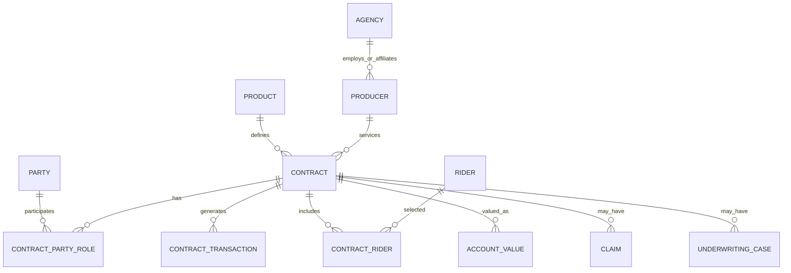

# Conceptual Model

The model intentionally uses `CONTRACT_PARTY_ROLE` instead of putting owner/annuitant/beneficiary columns directly on the contract. This allows multiple beneficiaries, role changes, effective dating and the same party to play different roles.
